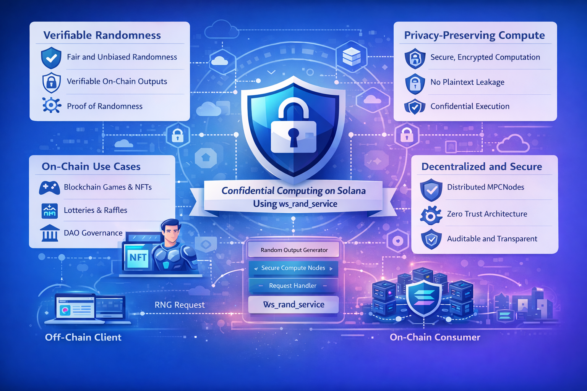

# ws_rand_service

A verifiable, privacy-preserving randomness service for on-chain applications, built with Rust and confidential compute.

---

## Overview

`ws_rand_service` is a general-purpose **randomness infrastructure service** designed for blockchain applications that require **fair, unbiased, and verifiable random values**.

Unlike naive on-chain randomness approaches (e.g. blockhash-based randomness), this service is built with a strong security model in mind and is suitable for **games, lotteries, DeFi protocols, governance mechanisms, and NFT applications**.

The project is intentionally designed as a **reusable primitive**, not a one-off demo.

---

## Key Goals

- ✅ Fair and unbiased randomness generation  
- ✅ Verifiable outputs consumable by smart contracts  
- ✅ Privacy-preserving computation (no plaintext leakage)  
- ✅ Clean separation between randomness generation and consumption  
- ✅ Extensible architecture for future protocols

---

## Architecture (High-Level)



The service is designed so that:
- Randomness **cannot be influenced** by a single actor
- Outputs can be **verified on-chain**
- Internal computation logic can remain **confidential**

---

## Use Cases

- 🎮 On-chain games and loot systems  
- 🎟️ Lotteries and raffles  
- 🖼️ NFT trait generation  
- 🗳️ DAO governance (random selection, ordering)  
- 📉 DeFi mechanisms requiring unbiased randomness  

---

## Design Principles

- **Security-first**: No reliance on predictable or manipulable on-chain entropy
- **Minimal trust assumptions**: No single oracle or operator controls outcomes
- **Composable**: Easy to integrate with different programs and workflows
- **Protocol-agnostic**: Not tied to a single application or contract

---

## Project Structure (WIP)

```
ws_rand_service/
├── src/
│ ├── core/ # Core randomness logic
│ ├── service/ # Request / response handling
│ ├── types/ # Shared data structures
│ └── lib.rs
├── examples/ # Example integrations
├── tests/
└── README.md
```

---

## Current Status

⚠️ **Early development / experimental**

This repository is under active development.  
APIs, interfaces, and internal design may change as the project evolves.

---

## Roadmap

- [ ] Core randomness computation module
- [ ] Verifiable output format
- [ ] Solana example consumer program
- [ ] Security review and threat model
- [ ] Documentation and usage examples

---

## Security Notes

This project aims to avoid common randomness pitfalls such as:
- Block producer manipulation
- Predictable entropy sources
- Single-operator control

That said, **this code has not yet been audited**.  
Do not use in production environments without proper review.

---

## License

MIT License

---

## Disclaimer

This software is provided "as is", without warranty of any kind.  
Use at your own risk.

---
